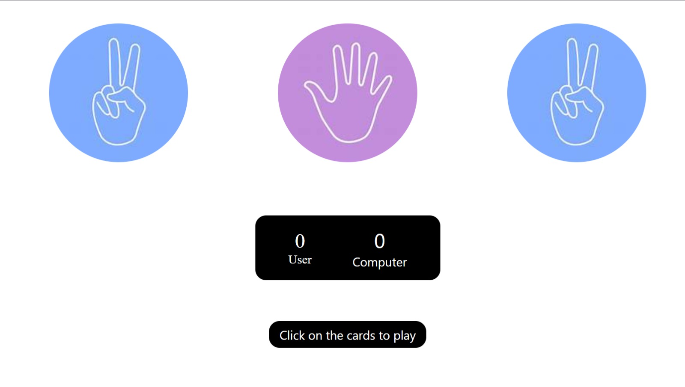

# Rock Paper Scissor game

## Description
This is a simple rock paper scissor game built using HTML, CSS and JavaScript

## Features
- Play against computer
- Random computer choices
- Live score update
- Instant result display

## Technologies used
- HTML
- CSS
- JavaScript
- Git(version-control)

## Tools used
- VScode
- GitHub
- Netlify(for hosting and domain)

## How to Play
- Click on rock, paper or scissor
- check the log message for result
- check the score card for comparsion

## Screenshot


## Live Demo
[click here](https://rock-paper-scissors-by-kira.netlify.app/)

## Project Structure
```
Project/
|--index.html
|--scripts/
  |--script.js
|--styles/
  |--style.css

```

